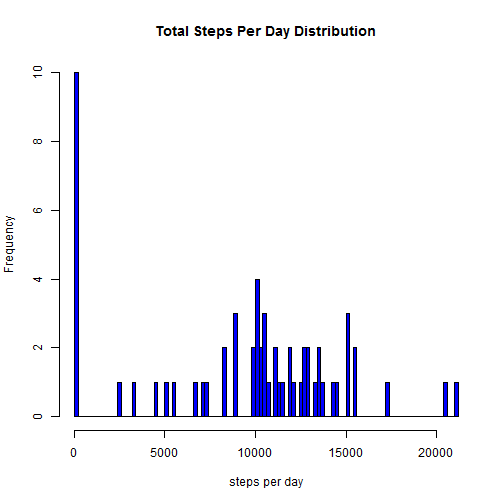
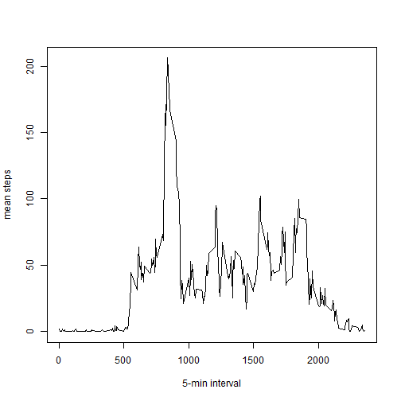
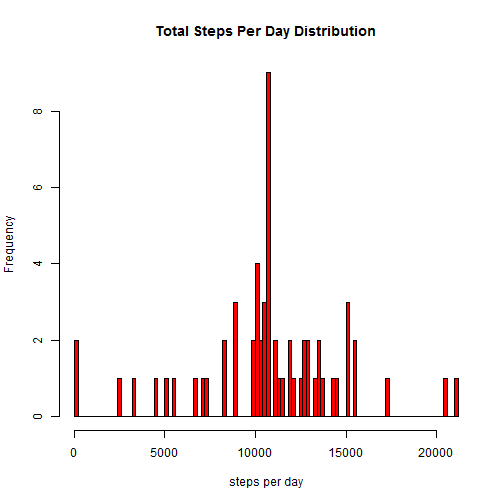
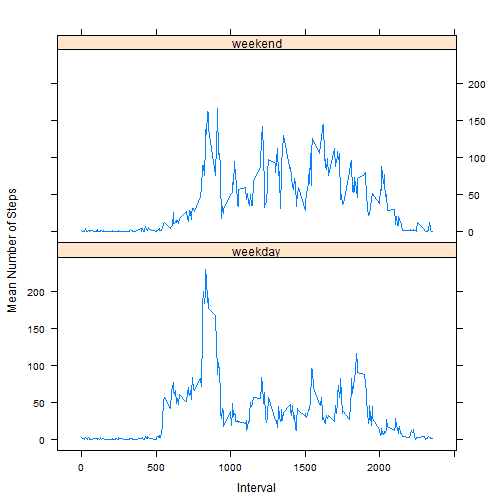

This report is created as part of the Reproducible Research course assignment under the Coursera Johns Hopkins Data Science Specialization series.

### Loading the data

Assumption: the "activity.csv" data file is in the current working directory folder.


```r
activity <- read.csv("activity.csv")
```


### Mean total number of steps taken per day


Use the aggregate function to sum the total number of steps taken for each date.


```r
a <- aggregate(activity$steps, by = list(activity$date),FUN = sum,na.rm=TRUE)
```


#### Histogram of the total number of steps taken per day:

Use the above data frame generated by the aggregate function to plot the histogram.


```r
hist(a$x,xlab="steps per day",main="Total Steps Per Day Distribution",col='blue',breaks=100)
```

 

#### Mean and Median of the total number of steps per day:


```r
#mean
mu <- mean(a$x)
#median
md <- median(a$x)
```

The Mean of the total steps taken per day is : 9354.2295
The Median of the total steps taken per day is : 10395


### Average Daily Activity Pattern


#### Time series plot of the 5-minute interval and the average number of steps taken (averaged across all days)


Just like above, use the aggregate function again, though this time to find the mean. 


```r
a1 <- aggregate(activity$steps, by = list(activity$interval),FUN = mean,na.rm=TRUE)
```

Now plot the time series plot.


```r
plot(a1$Group.1,a1$x,type='l',xlab="5-min interval", ylab="mean steps")
```

 

#### 5-min interval, on average across all the days, with maximum number of steps

The desired interval value can be computed as :


```r
intvl <- a1[which.max(a1$x),]
```


Hence, the 5-min interval with maximum average number of steps = 835


### Imputing Missing Values

1 - Number of missing values in the dataset


```r
missing.vals <- sum(!complete.cases(activity))
```


Total number of missing values in the input dataset : 2304


2 -- Strategy for filling in all of the missing values of the dataset

Use the mean for the given interval (as computed above) to fill in the missing value of the steps in the activity dataset


3 -- Create new dataset


```r
activity.new <- activity
for (counter in (1 : nrow(activity) ) ){
  if (is.na(activity[counter,1])){
    interval <- activity[counter,3]
    day.mean <- a1[(a1$Group.1==interval),2]
    activity.new[counter,1] <- day.mean
  }
}
```


4 -- Plot histogram of the new data set and recompute the mean and median


```r
a2 <- aggregate(activity.new$steps, by = list(activity.new$date),FUN = sum,na.rm=TRUE)

hist(a2$x,xlab="steps per day",main="Total Steps Per Day Distribution",col='red',breaks=100)
```

 


The new Mean of the Total steps per day is : 1.0766 &times; 10<sup>4</sup>.
The new Median of the Total steps per day is : 1.0766 &times; 10<sup>4</sup>.


Having adopted the given strategy (as in step 2), the mean and median, after creation of the new dataset with imputed values, shift by 1411.9592 and 371.1887 respectively.


### Differences in activity patterns on weekdays and weekends


1 -- Create new variable to indicate if the date corresponds to weekday or weekend


```r
activity.new$day.of.week <- weekdays(as.Date(activity.new$date))

activity.new$day.type <- ifelse(activity.new$day.of.week %in% c("Saturday","Sunday"), "weekend","weekday") 
```


2 -- Plot of mean number of steps vs interval for weekdays and weekends


```r
mean.weekday.steps <- aggregate(activity.new$steps,by = list(activity.new$interval,activity.new$day.type), FUN=mean)

#head(mean.weekday.steps)

colnames(mean.weekday.steps) <- c("interval","day.type","mean.steps")
```


```
## Loading required package: lattice
```


```r
xyplot(mean.weekday.steps$mean.steps ~ mean.weekday.steps$interval | mean.weekday.steps$day.type, data = mean.weekday.steps,layout=c(1,2),type="l",ylab="Mean Number of Steps", xlab="Interval")
```

 

As seen from the above plots, the activity pattern follows similar trend for weekdays and weekends though is slightly more on weekdays than on weekends.
